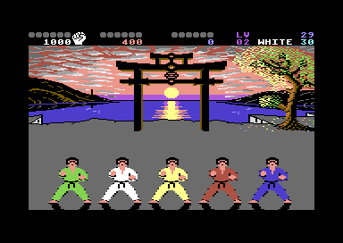

# Welcome to my Github pages

I'm Chris a keen software developer of over 35 years!
 
Throughout the years I have been constantly learning and evolving, wearing different suits, whether it is developer, devops, consultancy or some thing else.

 

One constant is that I always have a positive outlook, willing to learn from others, share what I know, am respectful and live life with humility. 

## 🔧 Technology and Tools

  

     

  

## 📈 Github Stats

Below you can see the Github statistics for these repositories, however, over the years I have contributed to many projects and open source software in an official capacity with work related company accounts.

## 🖥️ Most Frequently Used Languages Here

<!--
**chrisgit/chrisgit** is a ✨ _special_ ✨ repository because its `README.md` (this file) appears on your GitHub profile.

Here are some ideas to get you started:

- 🔭 I’m currently working on ...
- 🌱 I’m currently learning ...
- 👯 I’m looking to collaborate on ...
- 🤔 I’m looking for help with ...
- 💬 Ask me about ...
- 📫 How to reach me: ...
- 😄 Pronouns: ...
- ⚡ Fun fact: ...
-->
